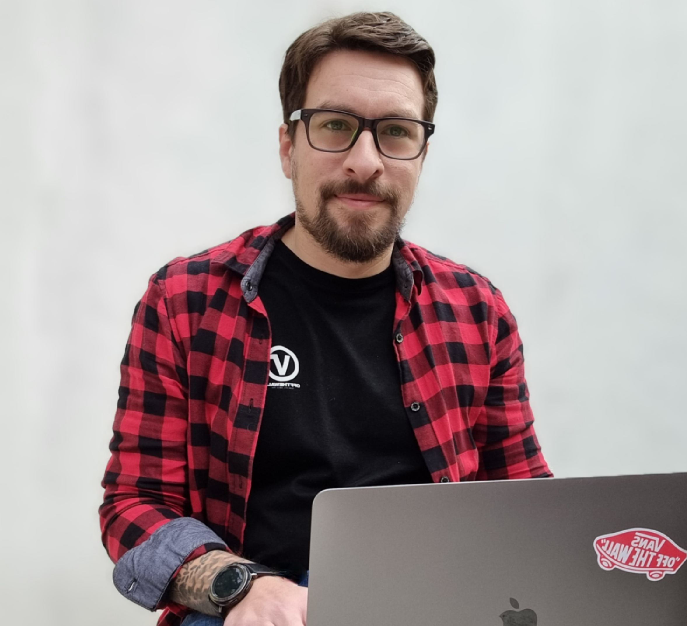
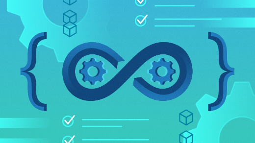

# About me

I currently work for Data Ops.
I have many years of experience working with BI, Big Data, Data Engineering and most recently DevOps teams.

I worked in market research, banking and fintech companies. I consider myself curious and pragmatic, I don't like to do repetitive tasks, that's why I found in pipelines and automation a great ally in my day to day.

I live in Argentina but I am willing to relocate, I am not actively looking for a job but I know how to listen, so you can contact me if you think my profile matches your project.

